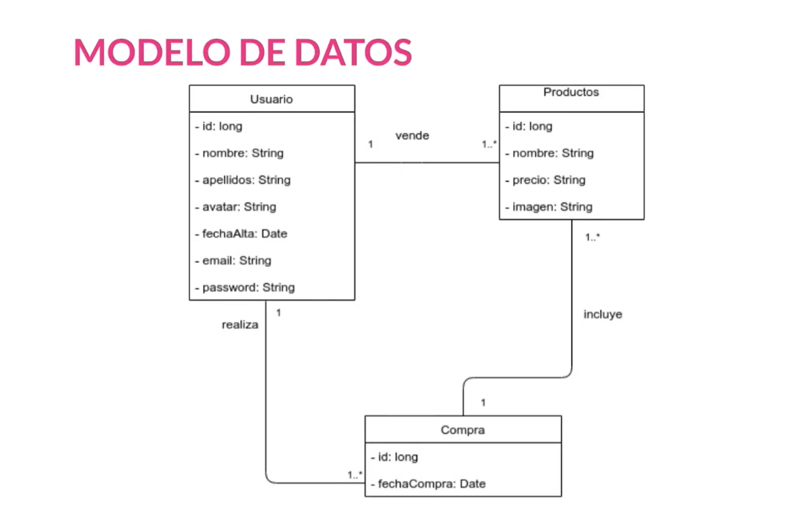
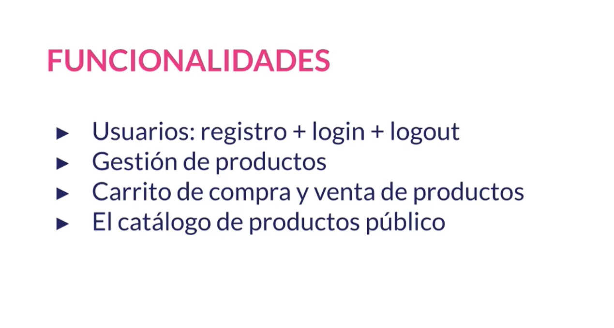

# Proyecto de Spring Framework - SpringBoot - Spring MVC

- [Proyecto de Spring Framework - SpringBoot - Spring MVC](#proyecto-de-spring-framework---springboot---spring-mvc)
- [0. Creación del proyecto](#0-creación-del-proyecto)
- [0.1. *pom.xml*](#01-pomxml)
- [0.2. *src/main/resources --\> application.properties*](#02-srcmainresources----applicationproperties)
- [1. Creación de las entidades](#1-creación-de-las-entidades)
	- [1.1. *com.shoppingcart.models --\> User.java*](#11-comshoppingcartmodels----userjava)
	- [1.2. *com.shoppingcart.models --\> Purchase.java*](#12-comshoppingcartmodels----purchasejava)
	- [1.3. *com.shoppingcart.models --\> Product.java*](#13-comshoppingcartmodels----productjava)
	- [1.4. *com.shoppingcart.config --\> AuditConfig.java*](#14-comshoppingcartconfig----auditconfigjava)
- [2. Creación de los repositorios](#2-creación-de-los-repositorios)
	- [2.1. *com.shoppingcart.repositories --\> UserRepository.java*](#21-comshoppingcartrepositories----userrepositoryjava)
	- [2.2. *com.shoppingcart.repositories --\> PurchaseRepository.java*](#22-comshoppingcartrepositories----purchaserepositoryjava)
	- [2.3. *com.shoppingcart.repositories --\> ProductRepository.java*](#23-comshoppingcartrepositories----productrepositoryjava)
	- [2.4. *src/main/resources --\> application.properties*](#24-srcmainresources----applicationproperties)
	- [2.5. *com.shoppingcart.ShoppingCart --\> ShoppingCartApplication.java* (Main)](#25-comshoppingcartshoppingcart----shoppingcartapplicationjava-main)
	- [2.7. Observaciones](#27-observaciones)
		- [Otras formas de generar la base de datos e insertar datos de ejemplo](#otras-formas-de-generar-la-base-de-datos-e-insertar-datos-de-ejemplo)

# 0. Creación del proyecto






# 0.1. *pom.xml*

```xml
<?xml version="1.0" encoding="UTF-8"?>
<project xmlns="http://maven.apache.org/POM/4.0.0" xmlns:xsi="http://www.w3.org/2001/XMLSchema-instance" xsi:schemaLocation="http://maven.apache.org/POM/4.0.0 https://maven.apache.org/xsd/maven-4.0.0.xsd">
	
	<modelVersion>4.0.0</modelVersion>
	<parent>
		<groupId>org.springframework.boot</groupId>
		<artifactId>spring-boot-starter-parent</artifactId>
		<version>2.7.6</version>
		<relativePath/> <!-- lookup parent from repository -->
	</parent>
	
	<groupId>com.example</groupId>
	<artifactId>ShoppingCart</artifactId>
	<version>0.0.1-SNAPSHOT</version>
	<packaging>war</packaging>
	<name>ShoppingCart</name>
	<description>online-ecommerce</description>
	
	<properties>
		<java.version>19</java.version>
	</properties>
	
	<dependencies>
	
	<!-- _______________________________________ Spring _________________________________________ -->
		<dependency>
			<groupId>org.springframework.boot</groupId>
			<artifactId>spring-boot-starter-data-jpa</artifactId>
		</dependency>
		
		<dependency>
			<groupId>org.springframework.boot</groupId>
			<artifactId>spring-boot-starter-data-redis</artifactId>
		</dependency>
		
		<dependency>
			<groupId>org.springframework.boot</groupId>
			<artifactId>spring-boot-starter-security</artifactId>
		</dependency>
		
		<dependency>
			<groupId>org.springframework.boot</groupId>
			<artifactId>spring-boot-starter-thymeleaf</artifactId>
		</dependency>
		
		<dependency>
			<groupId>org.springframework.boot</groupId>
			<artifactId>spring-boot-starter-web</artifactId>
		</dependency>
		
		<dependency>
			<groupId>org.springframework.session</groupId>
			<artifactId>spring-session-data-redis</artifactId>
		</dependency>
		
		<dependency>
			<groupId>org.springframework.boot</groupId>
			<artifactId>spring-boot-starter-tomcat</artifactId>
			<scope>provided</scope>
		</dependency>
		
		<dependency>
			<groupId>org.springframework.boot</groupId>
			<artifactId>spring-boot-starter-test</artifactId>
			<scope>test</scope>
		</dependency>
		
		<dependency>
			<groupId>org.springframework.security</groupId>
			<artifactId>spring-security-test</artifactId>
			<scope>test</scope>
		</dependency>
		
		<!-- _______________________________________ Database _________________________________________ -->
		<dependency>
			<groupId>com.h2database</groupId>
			<artifactId>h2</artifactId>
			<scope>runtime</scope>
		</dependency>
		
		<!-- _______________________________________ Thymeleaf _________________________________________ -->
		<dependency>
			<groupId>org.thymeleaf.extras</groupId>
			<artifactId>thymeleaf-extras-springsecurity5</artifactId>
		</dependency>
		
		<!-- _______________________________________ WebJars _________________________________________ -->
		<dependency>
		    <groupId>org.webjars</groupId>
		    <artifactId>bootstrap</artifactId>
		    <version>5.2.2</version>
		</dependency>
		
		<dependency>
		    <groupId>org.webjars</groupId>
		    <artifactId>jquery</artifactId>
		    <version>3.6.1</version>
		</dependency>
		
		<dependency>
		    <groupId>org.webjars</groupId>
		    <artifactId>webjars-locator</artifactId>
		    <version>0.46</version>
		</dependency>

	</dependencies>

	<build>
		<plugins>
			<plugin>
				<groupId>org.springframework.boot</groupId>
				<artifactId>spring-boot-maven-plugin</artifactId>
			</plugin>
		</plugins>
	</build>

</project>
```

# 0.2. *src/main/resources --> application.properties*

```properties
# Puerto de la aplicacion
server.port=9000
# Configuracion del almacenamiento de sesiones con Redis
spring.session.store-type=redis

# URL jdbc de conexion a la base de datos
spring.datasource.url=jdbc:h2:./ShoppingCart

# Usuario y contraseña de la base de datos
spring.datasource.username=h2
spring.datasource.password=12345

# Habilitamos la consola de H2
# http://localhost:{server.port}/h2-console
# En nuestro caso http://localhost:9000/h2-console
spring.h2.console.enabled=true

# Habilitamos los mensajes sql en el log
spring.jpa.show-sql=true


spring.thymeleaf.cache=false
```

# 1. Creación de las entidades

## 1.1. *com.shoppingcart.models --> User.java*

```java
package com.shoppingcart.models;

import java.io.Serializable;
import java.sql.Date;
import java.util.HashSet;
// import java.util.Date;
import java.util.Objects;
import java.util.Set;

import org.springframework.data.annotation.CreatedDate;
import org.springframework.data.jpa.domain.support.AuditingEntityListener;

import jakarta.persistence.Column;
import jakarta.persistence.Entity;
import jakarta.persistence.EntityListeners;
import jakarta.persistence.GeneratedValue;
import jakarta.persistence.GenerationType;
import jakarta.persistence.Id;
import jakarta.persistence.OneToMany;
import jakarta.persistence.CascadeType;
import jakarta.persistence.FetchType;
import jakarta.persistence.Table;
import jakarta.persistence.Temporal;
import jakarta.persistence.TemporalType;
import jakarta.validation.Valid;

@Entity
@Table(name = "Users")
@EntityListeners(AuditingEntityListener.class) // for @CreatedDate (audit)
public class User implements Serializable {
	
	private static final long serialVersionUID = 1L;

	/******************************************* ATRIBUTOS *********************************************/
	@Id
	@Column(name = "UserId", unique = true)
	@GeneratedValue(strategy = GenerationType.IDENTITY)
	private long userId;
	
	@Column(name = "UserName", length = 100, nullable = false)
	private String userName;
	
	@Column(name = "UserSurname", length = 100, nullable = false)
	private String userSurname;
	
	@Column(name = "UserAvatar", length = 100, nullable = true)
	private String userAvatar;
	
	@CreatedDate
	@Temporal(TemporalType.TIMESTAMP)
	@Column(name = "UserEntryDate", nullable = false)
	private Date userEntryDate;
	
	@Column(name = "UserEmail", length = 100, nullable = false)
	private String userEmail;
	
	@Column(name = "UserPassword", length = 100, nullable = false)
	private String userPassword;
	

	/******************************************* RELACIONES *********************************************/
	// relational field with Purchase (1:N) (one user can make one or more purchases)
	@Valid
	@OneToMany(mappedBy = "purchaseOwner" , fetch = FetchType.LAZY, cascade = CascadeType.REMOVE)
	Set<Purchase> purchasesList = new HashSet<>();
	
	// relational field with Product (1:N) (one user can sell one or more products)
	@Valid
	@OneToMany(mappedBy = "productOwner" , fetch = FetchType.LAZY, cascade = CascadeType.REMOVE)
	Set<Product> productsList = new HashSet<>();
	
	
	/******************************************* CONSTRUCTORES *********************************************/
	public User(String userName, String userSurname, String userAvatar, String userEmail, String userPassword) { // without id
		super();
		this.userName = userName;
		this.userSurname = userSurname;
		this.userAvatar = userAvatar;
		this.userEmail = userEmail;
		this.userPassword = userPassword;
	}

	public User() {
		super();
	}

	
	/******************************************* GETTERS Y SETTERS *********************************************/
	public long getUserId() {
		return userId;
	}

	public void setId(long userId) {
		this.userId = userId;
	}

	public String getUserName() {
		return userName;
	}

	public void setUserName(String userName) {
		this.userName = userName;
	}

	public String getUserSurname() {
		return userSurname;
	}

	public void setUserSurname(String userSurname) {
		this.userSurname = userSurname;
	}

	public String getUserAvatar() {
		return userAvatar;
	}

	public void setUserAvatar(String userAvatar) {
		this.userAvatar = userAvatar;
	}

	public Date getUserEntryDate() {
		return userEntryDate;
	}

	public void setUserEntryDate(Date userEntryDate) {
		this.userEntryDate = userEntryDate;
	}

	public String getUserEmail() {
		return userEmail;
	}

	public void setUserEmail(String userEmail) {
		this.userEmail = userEmail;
	}

	public String getUserPassword() {
		return userPassword;
	}

	public void setUserPassword(String userPassword) {
		this.userPassword = userPassword;
	}

	public static long getSerialversionuid() {
		return serialVersionUID;
	}
	
	
	/******************************************* MÉTODOS *********************************************/
	public void addPurchase(Purchase purchase) { // the point of view for the relation between User and Purchase will be, how many purchases has done one user?
		this.purchasesList.add(purchase);
	}
	
	public void addProduct(Product product) { 	 // the point of view for the relation between User and Product will be, how many products has sold one user?
		this.productsList.add(product);
	}
	
	/******************************************* HasCode y Equals *********************************************/
	@Override
	public int hashCode() {
		return Objects.hash(userId, userAvatar, userEmail, userEntryDate, userName, userPassword, userSurname);
	}

	@Override
	public boolean equals(Object obj) {
		if (this == obj) {
			return true;
		}
		if (!(obj instanceof User)) {
			return false;
		}
		User other = (User) obj;
		return userId == other.userId && Objects.equals(userAvatar, other.userAvatar)
				&& Objects.equals(userEmail, other.userEmail) && Objects.equals(userEntryDate, other.userEntryDate)
				&& Objects.equals(userName, other.userName) && Objects.equals(userPassword, other.userPassword)
				&& Objects.equals(userSurname, other.userSurname);
	}
	
	
	/******************************************* ToString *********************************************/
	@Override
	public String toString() {
		return "\nUser [userId=" + userId + ", userName=" + userName + ", userSurname=" + userSurname + ", userAvatar=" + userAvatar + ", userEntryDate=" + userEntryDate + ", userEmail=" + userEmail + ", userPassword=" + userPassword + "]";
	}
}
```

## 1.2. *com.shoppingcart.models --> Purchase.java*

```java
package com.shoppingcart.models;

import java.io.Serializable;
import java.sql.Date;
import java.util.HashSet;
//import java.util.Date;
import java.util.Objects;
import java.util.Set;

import org.springframework.data.annotation.CreatedDate;
import org.springframework.data.jpa.domain.support.AuditingEntityListener;

import jakarta.persistence.CascadeType;
import jakarta.persistence.Column;
import jakarta.persistence.Entity;
import jakarta.persistence.EntityListeners;
import jakarta.persistence.FetchType;
import jakarta.persistence.GeneratedValue;
import jakarta.persistence.GenerationType;
import jakarta.persistence.Id;
import jakarta.persistence.JoinColumn;
import jakarta.persistence.ManyToOne;
import jakarta.persistence.OneToMany;
import jakarta.persistence.Table;
import jakarta.persistence.Temporal;
import jakarta.persistence.TemporalType;
import jakarta.validation.Valid;

@Entity
@Table(name = "Purchases")
@EntityListeners(AuditingEntityListener.class) // for @CreatedDate (audit)
public class Purchase implements Serializable {

	private static final long serialVersionUID = 1L;

	/******************************************* ATRIBUTOS *********************************************/
	@Id
	@Column(name = "PurchaseId", unique = true)
	@GeneratedValue(strategy = GenerationType.IDENTITY)
	private long purchaseId;
	
	@CreatedDate
	@Temporal(TemporalType.TIMESTAMP)
	@Column(name = "PurchaseDate", nullable = false)
	private Date purchaseEntryDate;
	

	/******************************************* RELACIONES *********************************************/
	// relational field with User (N:1) (one or more purchases can be made by one user)
	@Valid
	@ManyToOne(optional = false, cascade = CascadeType.ALL)
	@JoinColumn(name = "userId")
	private User purchaseOwner;

	// relational field with Product (1:N) (one purchase can include one or more products)
	@Valid
	@OneToMany(mappedBy = "purchase" , fetch = FetchType.LAZY, cascade = CascadeType.REMOVE)
	Set<Product> productsList = new HashSet<>();
	
	
	/******************************************* CONSTRUCTORES *********************************************/
	public Purchase(User purchaseOwner) { // without id and date
		super();
		this.purchaseOwner = purchaseOwner;
	}

	public Purchase() {
		super();
	}

	
	/******************************************* GETTER Y SETTERS *********************************************/
	public long getPurchaseId() {
		return purchaseId;
	}

	public void setId(long purchaseId) {
		this.purchaseId = purchaseId;
	}

	public Date getPurchaseEntryDate() {
		return purchaseEntryDate;
	}

	public void setPurchaseEntryDate(Date purchaseEntryDate) {
		this.purchaseEntryDate = purchaseEntryDate;
	}

	public User getPurchaseOwner() {
		return purchaseOwner;
	}

	public void setOwner(User purchaseOwner) {
		this.purchaseOwner = purchaseOwner;
	}

	public static long getSerialversionuid() {
		return serialVersionUID;
	}

	
	/******************************************* MÉTODOS *********************************************/
	public void addProduct(Product product) { // the point of view for the relation between Purchase and Product will be, how many products are included in one purchase?
		this.productsList.add(product);
	}
	
	
	/******************************************* HashCode y Equals *********************************************/
	@Override
	public int hashCode() {
		return Objects.hash(purchaseId, purchaseOwner, purchaseEntryDate);
	}

	@Override
	public boolean equals(Object obj) {
		if (this == obj) {
			return true;
		}
		if (!(obj instanceof Purchase)) {
			return false;
		}
		Purchase other = (Purchase) obj;
		return purchaseId == other.purchaseId && Objects.equals(purchaseOwner, other.purchaseOwner)
				&& Objects.equals(purchaseEntryDate, other.purchaseEntryDate);
	}

	
	/******************************************* ToString *********************************************/
	@Override
	public String toString() {
		return "\nPurchase [purchaseId=" + purchaseId + ", purchaseEntryDate=" + purchaseEntryDate + ", purchaseOwner=" + purchaseOwner + "]";
	}
}
```

## 1.3. *com.shoppingcart.models --> Product.java*

```java
package com.shoppingcart.models;

import java.io.Serializable;
import java.util.Objects;

import jakarta.persistence.CascadeType;
import jakarta.persistence.Column;
import jakarta.persistence.Entity;
import jakarta.persistence.GeneratedValue;
import jakarta.persistence.GenerationType;
import jakarta.persistence.Id;
import jakarta.persistence.JoinColumn;
import jakarta.persistence.ManyToOne;
import jakarta.persistence.Table;
import jakarta.validation.Valid;

@Entity
@Table(name = "Products")
public class Product implements Serializable {

	private static final long serialVersionUID = 1L;

	/******************************************* ATRIBUTOS *********************************************/
	@Id
	@Column(name = "ProductId", unique = true)
	@GeneratedValue(strategy = GenerationType.IDENTITY)
	private long productId;
	
	@Column(name = "ProductName", length = 100, nullable = false)
	private String productName;
	
	@Column(name = "ProductPrice", nullable = true)
	private double productPrice;
	
	@Column(name = "ProductImage", nullable = true)
	private String productImage;
	

	/******************************************* RELACIONES *********************************************/
	// relational field with User (N:1) (one or more product can be sold by one user)
	@Valid
	@ManyToOne(optional = false, cascade = CascadeType.ALL)
	@JoinColumn(name = "userId")
	private User productOwner;
	
	// relational field with Purchase (N:1) (one or more product can be included in one purchase)
	@Valid
	@ManyToOne(optional = false, cascade = CascadeType.ALL)
	@JoinColumn(name = "purchaseId")
	private Purchase purchase;

	
	/******************************************* CONSTRUCTORES *********************************************/
	public Product(String productName, double productPrice, String productImage, @Valid User productOwner) { // without id and purchase
		super();
		this.productName = productName;
		this.productPrice = productPrice;
		this.productImage = productImage;
		this.productOwner = productOwner;
	}

	public Product() {
		super();
	}

	
	/******************************************* GETTERS Y SETTERS *********************************************/
	public long getProductId() {
		return productId;
	}

	public void setId(long productId) {
		this.productId = productId;
	}

	public String getProductName() {
		return productName;
	}

	public void setProductName(String productName) {
		this.productName = productName;
	}

	public double getProductPrice() {
		return productPrice;
	}

	public void setProductPrice(double productPrice) {
		this.productPrice = productPrice;
	}

	public String getProductImage() {
		return productImage;
	}

	public void setProductImage(String productImage) {
		this.productImage = productImage;
	}

	public User getProductOwner() {
		return productOwner;
	}

	public void setProductOwner(User productOwner) {
		this.productOwner = productOwner;
	}

	public Purchase getPurchase() {
		return purchase;
	}

	public void setPurchase(Purchase purchase) {
		this.purchase = purchase;
	}

	public static long getSerialversionuid() {
		return serialVersionUID;
	}
	
	
	/******************************************* MÉTODOS *********************************************/

	
	/******************************************* HashCode y Equals *********************************************/
	@Override
	public int hashCode() {
		return Objects.hash(productId, productImage, productName, productOwner, productPrice, purchase);
	}

	@Override
	public boolean equals(Object obj) {
		if (this == obj) {
			return true;
		}
		if (!(obj instanceof Product)) {
			return false;
		}
		Product other = (Product) obj;
		return productId == other.productId && Objects.equals(productImage, other.productImage)
				&& Objects.equals(productName, other.productName) && Objects.equals(productOwner, other.productOwner)
				&& Double.doubleToLongBits(productPrice) == Double.doubleToLongBits(other.productPrice)
				&& Objects.equals(purchase, other.purchase);
	}

	
	/******************************************* ToString *********************************************/
	@Override
	public String toString() {
		return "\nProduct [productId=" + productId + ", productName=" + productName + ", productPrice=" + productPrice
				+ ", productImage=" + productImage + ", productOwner=" + productOwner + ", purchase=" + purchase + "]";
	}
}
```

## 1.4. *com.shoppingcart.config --> AuditConfig.java*

```java
package com.shoppingcart.config;

import org.springframework.context.annotation.Configuration;
import org.springframework.data.jpa.repository.config.EnableJpaAuditing;

@Configuration
@EnableJpaAuditing
public class AuditConfig {
	
	// with this class, Date fields will be automatics (system timestamp)
}
```

# 2. Creación de los repositorios

## 2.1. *com.shoppingcart.repositories --> UserRepository.java*

```java
package com.shoppingcart.repositories;

import org.springframework.data.jpa.repository.JpaRepository;
import org.springframework.stereotype.Repository;

import com.shoppingcart.models.User;

@Repository
public interface UserRepository extends JpaRepository<User, Long> {

	/**
	 * Devuelve el primer usuario que encuentre a través de un email (el email de un usuario debería de ser único)
	 * @param email
	 * @return
	 */
	User findFirstByEmail(String email);
}
```

## 2.2. *com.shoppingcart.repositories --> PurchaseRepository.java*

```java
package com.shoppingcart.repositories;

import java.util.List;

import org.springframework.data.jpa.repository.JpaRepository;
import org.springframework.stereotype.Repository;

import com.shoppingcart.models.Purchase;
import com.shoppingcart.models.User;

@Repository
public interface PurchaseRepository extends JpaRepository<Purchase, Long> {

	/**
	 * Devuelve la lista de compras de un usuario en particular
	 * @param purchaseOwner
	 * @return 
	 */
	List<Purchase> findByPurchaseOwner(User purchaseOwner);
}
```

## 2.3. *com.shoppingcart.repositories --> ProductRepository.java*

```java
package com.shoppingcart.repositories;

import java.util.List;

import org.springframework.data.jpa.repository.JpaRepository;
import org.springframework.stereotype.Repository;

import com.shoppingcart.models.Product;
import com.shoppingcart.models.Purchase;
import com.shoppingcart.models.User;

@Repository
public interface ProductRepository extends JpaRepository<Product, Long> {

	/**
	 * para buscar todos los productos de un propietario
	 * @param productOwner
	 * @return lista de productos
	 */
	List<Product> findByProductOwner(User productOwner);
	
	/**
	 * para buscar todos los productos de una compra
	 * @param purchase
	 * @return lista de productos
	 */
	List<Product> findByPurchase(Purchase purchase);
	
	/**
	 * para buscar todos los productos de una compra que sea nula (es decir, los productos que aún estén en venta)
	 * @return lista de productos
	 */
	List<Product> findByPrurchaseIsNull();
	
	/**
	 * para buscar los productos que contengan el nombre que se pasa como parámetro y su compra aún sea nula
	 * @param name
	 * @return lista de productos
	 */
	List<Product> findByNameContainsIgnoreCaseAndPurchaseIsNull(String name);
	
	/**
	 * para buscar los productos donde el propietario y el nombre sean los que le proporcionemos
	 * @param name
	 * @param productOwner
	 * @return lista de productos
	 */
	List<Product> findByNameContainsIgnoreCaseAndProductOwner(String name, User productOwner);
}
```

## 2.4. *src/main/resources --> application.properties*

```properties
# La propiedad spring.jpa.hibernate.ddl-auto (la cual es un atajo de la propiedad de hibernate hibernate.hbm2ddl.auto) 
# toma el valor create-drop cuando se utiliza una base de datos embebida (por ejemplo H2) y no se le indica otra forma de trabajar. 
# En otro caso, tomar el valor none. Si quisiéramos gestionar nosotros la creación de la base de datos, ese sería el valor que tendríamos que indicar
spring.jpa.hibernate.ddl-auto=create-drop
```

## 2.5. *com.shoppingcart.ShoppingCart --> ShoppingCartApplication.java* (Main)

Para cargar una serie de datos de forma rápida en los comienzos de nuestro desarrollo, podemos utilizar la clase *CommandLineRunner*

```java
package com.shoppingcart.ShoppingCart;

import java.util.Arrays;

import org.springframework.boot.CommandLineRunner;
import org.springframework.boot.SpringApplication;
import org.springframework.boot.autoconfigure.SpringBootApplication;
import org.springframework.context.annotation.Bean;

import com.shoppingcart.models.Product;
import com.shoppingcart.models.User;
import com.shoppingcart.repositories.ProductRepository;
import com.shoppingcart.repositories.UserRepository;

@SpringBootApplication
public class ShoppingCartApplication {

	public static void main(String[] args) {
		SpringApplication.run(ShoppingCartApplication.class, args);
	}
	
	@Bean
	public CommandLineRunner initData(UserRepository userRepository, ProductRepository productRepository) {
		return args -> {
			
			User user1 = new User("sergio", "diaz campos", null, "sergio@gmail.com", "123");
			user1 = userRepository.save(user1);
			
			productRepository.saveAll(Arrays.asList(
					new Product("Bicicleta de montaña", 100.0f, "https://www.decathlon.es/media/835/8350582/big_23c25284-2810-415d-8bcc-e6bebdb536fc.jpg", user1),
					new Product("Golf GTI Serie 2", 2500.0f, "https://www.minicar.es/large/Volkswagen-Golf-GTi-G60-Serie-II-%281990%29-Norev-1%3A18-i22889.jpg", user1),
					new Product("Raqueta de tenis", 10.5f, "https://imgredirect.milanuncios.com/fg/2311/04/tenis/Raqueta-tenis-de-segunda-mano-en-Madrid-231104755_1.jpg?VersionId=T9dPhTf.3ZWiAFjnB7CvGKsvbdfPLHht", user1),
					new Product("Xbox One X", 425.0f, "https://images.vibbo.com/635x476/860/86038583196.jpg", user1),
					new Product("Tripode flexible", 10.0f, "https://images.vibbo.com/635x476/860/86074256163.jpg", user1),
					new Product("Iphone 7 128 GB", 350.0f, "https://store.storeimages.cdn-apple.com/4667/as-images.apple.com/is/image/AppleInc/aos/published/images/i/ph/iphone7/rosegold/iphone7-rosegold-select-2016?wid=470&hei=556&fmt=jpeg&qlt=95&op_usm=0.5,0.5&.v=1472430205982", user1)
			));
		};
	}
}
```

## 2.7. Observaciones

### Otras formas de generar la base de datos e insertar datos de ejemplo

Como muchos podréis suponer, la forma en que hemos ido generando la base de datos e insertando datos de ejemplo no es la más ortodoxa, aunque es muy útil mientras aprendemos a desarrollar. Sin embargo, con un sistema en producción, dicho esquema de trabajo no sería el más viable.

En el caso de usar un SGBD más potente y remoto, lo normal es generar el esquema de la base de datos utilizando scripts de sql. Estos scripts suelen ser acumulativos; es decir, para la versión 3, lo que hará el script es modificar lo necesario de la versión 2, y añadir todos los elementos nuevos. Además, también se suelen usar scripts de sql para hacer la inserción de los datos iniciales.

Spring Boot, como en otras ocasiones, nos ofrece facilidades para la creación del esquema y la inserción de datos iniciales.

- La propiedad spring.jpa.hibernate.ddl-auto (la cual es un atajo de la propiedad de hibernate hibernate.hbm2ddl.auto) toma el valor create-drop cuando se utiliza una base de datos embebida (por ejemplo H2) y no se le indica otra forma de trabajar. En otro caso, tomar el valor none. Si quisiéramos gestionar nosotros la creación de la base de datos, ese sería el valor que tendríamos que indicar

> spring.jpa.hibernate.ddl-auto=none

- El script de creación de la base de datos debe llamarse schema.sql y debe colocarse en algún lugar del classpath. Un buen sitio para ello podría ser la ruta src/main/resources/, donde está el propio fichero application.properties.
- El script de inicialización de datos debe llamarse data.sql y debe colocarse en el mismo lugar del fichero anterior.

