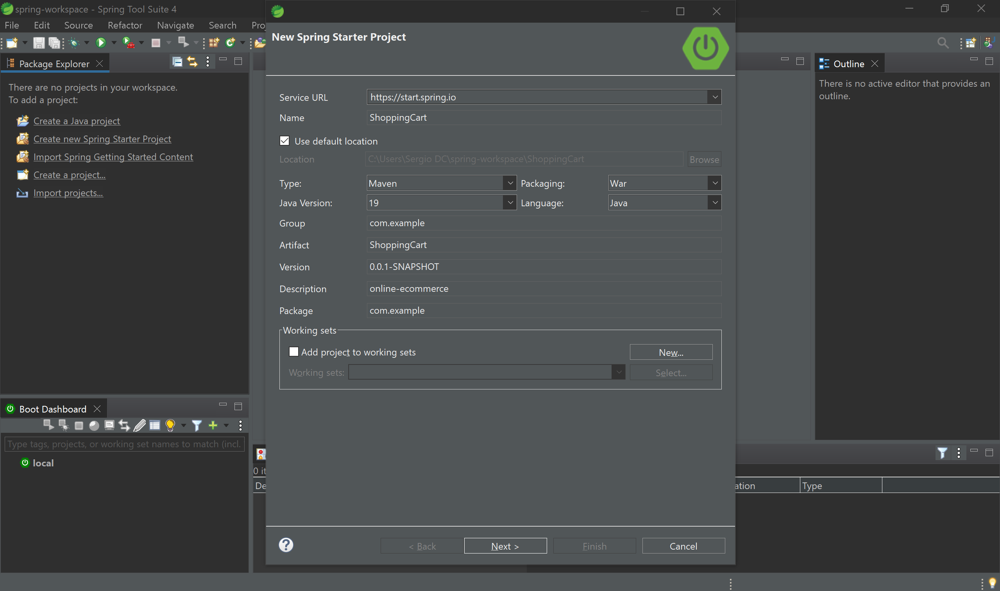

# Proyecto de Spring Framework - SpringBoot - Spring MVC

# 0. Creación del proyecto





# 0.1. *pom.xml*

```xml
<?xml version="1.0" encoding="UTF-8"?>
<project xmlns="http://maven.apache.org/POM/4.0.0" xmlns:xsi="http://www.w3.org/2001/XMLSchema-instance" xsi:schemaLocation="http://maven.apache.org/POM/4.0.0 https://maven.apache.org/xsd/maven-4.0.0.xsd">
	
	<modelVersion>4.0.0</modelVersion>
	<parent>
		<groupId>org.springframework.boot</groupId>
		<artifactId>spring-boot-starter-parent</artifactId>
		<version>2.7.6</version>
		<relativePath/> <!-- lookup parent from repository -->
	</parent>
	
	<groupId>com.example</groupId>
	<artifactId>ShoppingCart</artifactId>
	<version>0.0.1-SNAPSHOT</version>
	<packaging>war</packaging>
	<name>ShoppingCart</name>
	<description>online-ecommerce</description>
	
	<properties>
		<java.version>19</java.version>
	</properties>
	
	<dependencies>
	
	<!-- _______________________________________ Spring _________________________________________ -->
		<dependency>
			<groupId>org.springframework.boot</groupId>
			<artifactId>spring-boot-starter-data-jpa</artifactId>
		</dependency>
		
		<dependency>
			<groupId>org.springframework.boot</groupId>
			<artifactId>spring-boot-starter-data-redis</artifactId>
		</dependency>
		
		<dependency>
			<groupId>org.springframework.boot</groupId>
			<artifactId>spring-boot-starter-security</artifactId>
		</dependency>
		
		<dependency>
			<groupId>org.springframework.boot</groupId>
			<artifactId>spring-boot-starter-thymeleaf</artifactId>
		</dependency>
		
		<dependency>
			<groupId>org.springframework.boot</groupId>
			<artifactId>spring-boot-starter-web</artifactId>
		</dependency>
		
		<dependency>
			<groupId>org.springframework.session</groupId>
			<artifactId>spring-session-data-redis</artifactId>
		</dependency>
		
		<dependency>
			<groupId>org.springframework.boot</groupId>
			<artifactId>spring-boot-starter-tomcat</artifactId>
			<scope>provided</scope>
		</dependency>
		
		<dependency>
			<groupId>org.springframework.boot</groupId>
			<artifactId>spring-boot-starter-test</artifactId>
			<scope>test</scope>
		</dependency>
		
		<dependency>
			<groupId>org.springframework.security</groupId>
			<artifactId>spring-security-test</artifactId>
			<scope>test</scope>
		</dependency>
		
		<!-- _______________________________________ Database _________________________________________ -->
		<dependency>
			<groupId>com.h2database</groupId>
			<artifactId>h2</artifactId>
			<scope>runtime</scope>
		</dependency>
		
		<!-- _______________________________________ Thymeleaf _________________________________________ -->
		<dependency>
			<groupId>org.thymeleaf.extras</groupId>
			<artifactId>thymeleaf-extras-springsecurity5</artifactId>
		</dependency>
		
		<!-- _______________________________________ WebJars _________________________________________ -->
		<dependency>
		    <groupId>org.webjars</groupId>
		    <artifactId>bootstrap</artifactId>
		    <version>5.2.2</version>
		</dependency>
		
		<dependency>
		    <groupId>org.webjars</groupId>
		    <artifactId>jquery</artifactId>
		    <version>3.6.1</version>
		</dependency>
		
		<dependency>
		    <groupId>org.webjars</groupId>
		    <artifactId>webjars-locator</artifactId>
		    <version>0.46</version>
		</dependency>

	</dependencies>

	<build>
		<plugins>
			<plugin>
				<groupId>org.springframework.boot</groupId>
				<artifactId>spring-boot-maven-plugin</artifactId>
			</plugin>
		</plugins>
	</build>

</project>
```

# 0.2. *application.properties*

```properties
# Puerto de la aplicacion
server.port=9000
# Configuracion del almacenamiento de sesiones con Redis
spring.session.store-type=redis

# URL jdbc de conexion a la base de datos
spring.datasource.url=jdbc:h2:./ShoppingCart

# Usuario y contraseña de la base de datos
spring.datasource.username=h2
spring.datasource.password=12345

# Habilitamos la consola de H2
# http://localhost:{server.port}/h2-console
# En nuestro caso http://localhost:9000/h2-console
spring.h2.console.enabled=true

# Habilitamos los mensajes sql en el log
spring.jpa.show-sql=true


spring.thymeleaf.cache=false
```